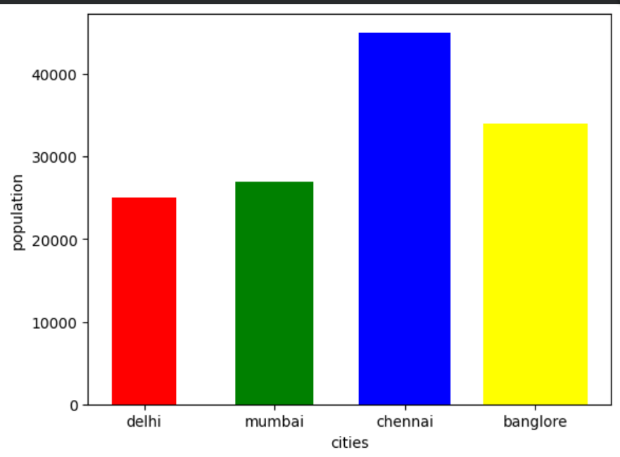
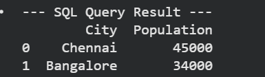

# python-sql-portfolio
  Data Analyst | Python &amp; SQL Specialist 
  
# Hey, I'm Devank. I build data tools that actually work.

I’m a Data Analyst who loves digging into **MySQL** databases and turning messy rows of data into clean, visual reports. If you're tired of staring at confusing spreadsheets, I can help you automate the boring stuff.

### What I’m good at:
* **MySQL:** I write clean, optimized queries to get exactly the data you need.
* **Python (Pandas):** I use **Spyder** to build scripts that clean up data fast—no more manual fixing.
* **Matplotlib:** I turn those numbers into charts that actually make sense.

### Why work with me?
I don’t just "move data" around. I focus on building scripts that save you time. Instead of spending hours in Excel, you can just run my Python script and get your charts instantly. 

### My Population Analysis Script
Below is the code I used to generate the chart:

import pandas as pd
import matplotlib.pyplot as plt

cities = ["Delhi", "Mumbai", "Chennai", "Bangalore"]
population = [25000, 27000, 45000, 34000]

s = pd.Series(population, index=cities)
s.plot(kind='bar', width=0.5, color=["red", "green", "blue", "yellow"])

plt.xlabel("Cities")
plt.ylabel("Population")
plt.show()

### 📊 Project Preview

##  Database Management (SQL)
I use SQL to extract specific insights from large datasets.

**Query used to filter high-population cities:**

SELECT * FROM cities 
WHERE population > 30000;

